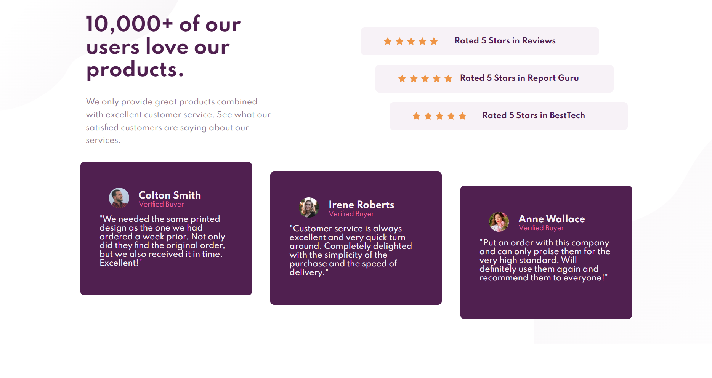

# Frontend Mentor - Social proof section solution

This is a solution to the [Social proof section challenge on Frontend Mentor](https://www.frontendmentor.io/challenges/social-proof-section-6e0qTv_bA). Frontend Mentor challenges help you improve your coding skills by building realistic projects. 

## Table of contents

- [Overview](#overview)
  - [The challenge](#the-challenge)
  - [Screenshot](#screenshot)
  - [Links](#links)
- [My process](#my-process)
  - [Built with](#built-with)
  - [What I learned](#what-i-learned)
  - [Continued development](#continued-development)
  - [Useful resources](#useful-resources)
- [Author](#author)
- [Acknowledgments](#acknowledgments)

**Note: Delete this note and update the table of contents based on what sections you keep.**

## Overview

### The challenge

Users should be able to:

- View the optimal layout for the section depending on their device's screen size

### Screenshot

### Links

- Solution URL: [Add solution URL here](https://your-solution-url.com)
- Live Site URL: [Social_Proof_Section](https://jimcarey08.github.io/Social_Proof_Section/)

## My process

### Built with

- Semantic HTML5 markup
- CSS custom properties
- Flexbox
- CSS Grid
- Mobile-first workflow

### What I learned

I learn more about grid and flexbox, especially in responsive design. I think i'm getting better in css, of course thats a lot to learn, but one challenge at a time. I'm understanding more about grid-area, grid-templates-area (kinda).

### Continued development

I think theres a lot to improve in responsive design and grid. Also optimize the mobile layout to make the desktop easier using grid and flexbox.

### Useful resources

- [Flexbox Froggy](https://flexboxfroggy.com) - This helped me to understand flexbox and values for flex properties.
- [Grid Garden](https://cssgridgarden.com) - This helped me to understand GRID and values for grid properties.

## Author

- Frontend Mentor - [@JimCarey08](https://www.frontendmentor.io/profile/JimCarey08)
- Twitter - [@LucasViCoisas](https://twitter.com/LucasViCoisas)

## Acknowledgments

The best way to learn something is doing it, so practice A LOT, eventually you will get better and better, and don't rush yout way to perfection. Perfection dosen't exist, practice exists...
